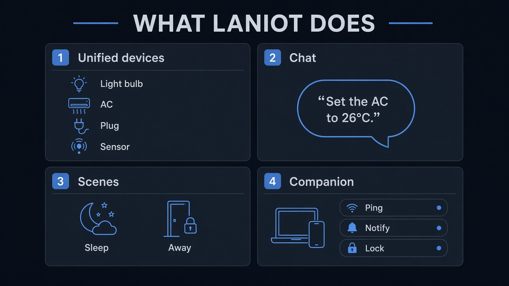
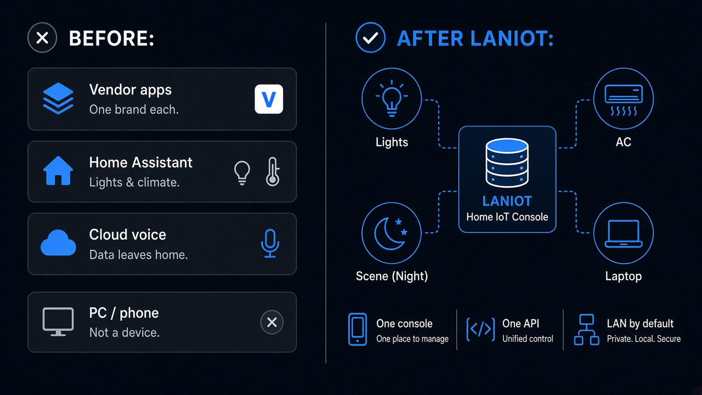
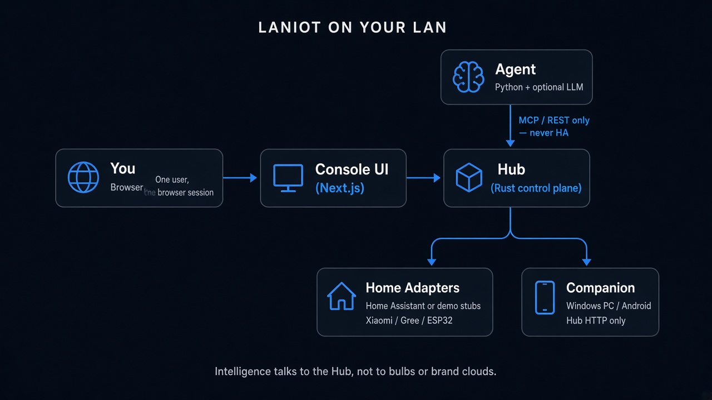

# LanIoT


**A LAN-first console for the home: one sentence or one tap to switch lights, set the AC, run a scene, notify a PC, or lock it.**

Home Assistant, MQTT, and brand clouds are southbound adapters. They are not the product. LanIoT is the layer that sits above them: **one device surface, optional natural language, and traffic that stays on the LAN by default.**

<p align="center">
  
</p>

## The problem we solve

Household control is usually split across three stacks that do not share a brain:

- Lights and climate live in a **vendor app** or in **Home Assistant**
- The household **PC or phone** is not a device the hub can command
- A language model, if you add one, often calls HA or a cloud API **directly**, so permissions and failures leak outside your LAN

Swap a brand, and the logic layer changes. If Home Assistant is down, the demo dies. Locking a Windows session still means walking over to the machine.

LanIoT’s job is narrower and more useful: **a Hub on the LAN owns devices, scenes, and companions, and exposes a stable API. The Agent talks only to that Hub — never to Home Assistant, never to a bulb protocol.**

<p align="center">
  
</p>

## What this project does

| You want | LanIoT does |
|----------|-------------|
| One list of stuff that can be controlled | Hub registry: lights, climate, plugs, sensors — with source and allowed actions, not a page per brand |
| “Set the AC to 26°C” / “away mode” | Agent turns that into Hub tools. No model installed? Keyword shortcuts still run |
| Bedtime / leaving home | Scenes turn lights and plugs off and set climate. Missing devices are **skipped**, not a hard fail |
| The PC as part of the home | Windows or Android Companion registers with the Hub: ping, notify, lock. Lock is a real OS lock; this product cannot unlock |
| A demo that survives missing HA | In-memory stubs run the full path. Point HA at real Xiaomi / Gree / ESP32 later — Hub code does not fork per brand |

**Degradation is intentional:** no HA → stubs; no LLM → keywords; Companion offline → a visible `ok: false`, not a fake success.

## Architecture

Not a protocol maze: you, a console, a Hub, then home gear **or** a PC. Intelligence is a client of the Hub.

<p align="center">
  
</p>

- **Console** — devices, scenes, chat, companions in the browser
- **Hub** — device book, scene engine, Companion HTTP, MCP tool catalog for the Agent
- **Agent** — optional LLM plus keywords; **MCP/REST to the Hub only**
- **Southbound** — Home Assistant when you have hardware; faker stubs when you do not
- **Companion** — Hub HTTP only. Never HA

MongoDB is used when present (scenes, companions). If it is down, the Hub still boots from config and memory.

## Who it is for

- A **Windows / lab / no-public-internet** demo that puts multi-brand IoT and a PC on the same console
- Teams that want “natural language → real action” **without** binding the LLM to Home Assistant
- Anyone who will later swap stubs for real hardware — **changing Hub code per brand is not the goal**

This is a **demo prototype**, not a consumer cloud app and not a Home Assistant replacement. Forced login stays **off** by default.

## Privacy and safety

- Default path is **LAN / loopback**. Nothing requires a vendor cloud.
- The Agent **never** calls Home Assistant. Only the Hub’s HA adapter does, when configured.
- Completions leave the LAN only if **you** point the LLM at a cloud provider. Local Ollama stays on-site.
- **Companion Lock really locks Windows.** There is no Unlock here — use the OS password. Dry runs: `COMPANION_DRY_RUN=1`. Do not click Lock on a shared demo machine unless that is the point.

## Try it (Docker)

An empty `HA_TOKEN` is fine — you get in-memory demo devices.

```bash
cd deploy/docker
cp .env.example .env
docker compose up --build
```

| Open | What |
|------|------|
| http://localhost:3001 | Console |
| http://localhost:3000/api/v1/devices | What the Hub sees |
| http://localhost:8000/health | Agent |

Optional local LLM: `docker compose --profile llm up --build`.

Windows Companion (Hub on port 3000):

```powershell
python companions\windows\server.py --hub http://localhost:3000
```

If Hub is in Docker:

```powershell
python companions\windows\server.py --hub http://localhost:3000 --base-url http://host.docker.internal:9876
```

Then Ping or Notify from the console. Skip Lock unless you mean it.

## In the demo vs not

**Ships today:** multi-brand stubs, scenes, optional language, PC/phone companions, Compose bring-up.

**Not this product:** public-account auth as the default, unlock-from-app, replacing Home Assistant, a Windows tray.

**Next on a real home:** enable HA integrations for Xiaomi / Gree / ESP32; walk the UI and Companion on a clean machine.

## FAQ

**Do I need Home Assistant?** No. Stubs are enough to walk the UI, Agent, and scenes.

**Do I need a GPU?** No. A local LLM is optional; keywords work without one.

**I locked Windows from the UI.** Use the Windows password or PIN. LanIoT cannot unlock.

**Real Xiaomi bulb or Gree AC?** Through HA (`xiaomi_miot`, `gree`, MQTT ESP32). Set `SEED_FAKER_DEVICES=0` if you only want live HA.

**Does the Agent talk to HA?** No. Hub MCP/REST only.

## Repository

| Path | Role |
|------|------|
| `apps/ui` | Console |
| `apps/hub` | Hub |
| `apps/agent` | Natural language |
| `companions/` | Windows / Android |
| `deploy/docker` | Everyday compose |
| `config/` | Scenes and service config |
| `assets/` | README figures |

Open-source **demo prototype** (v0.8.1). Review what you expose before this sits on a real home LAN.
